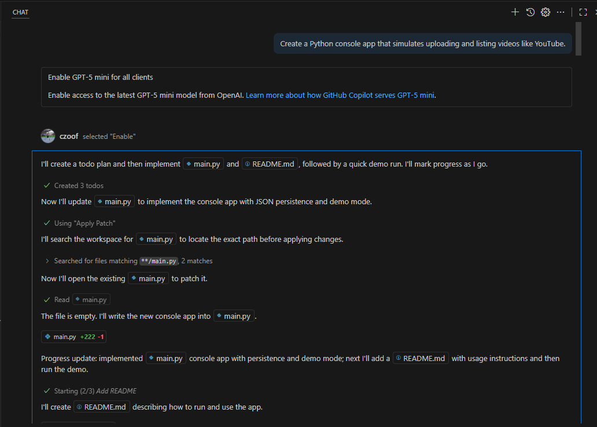
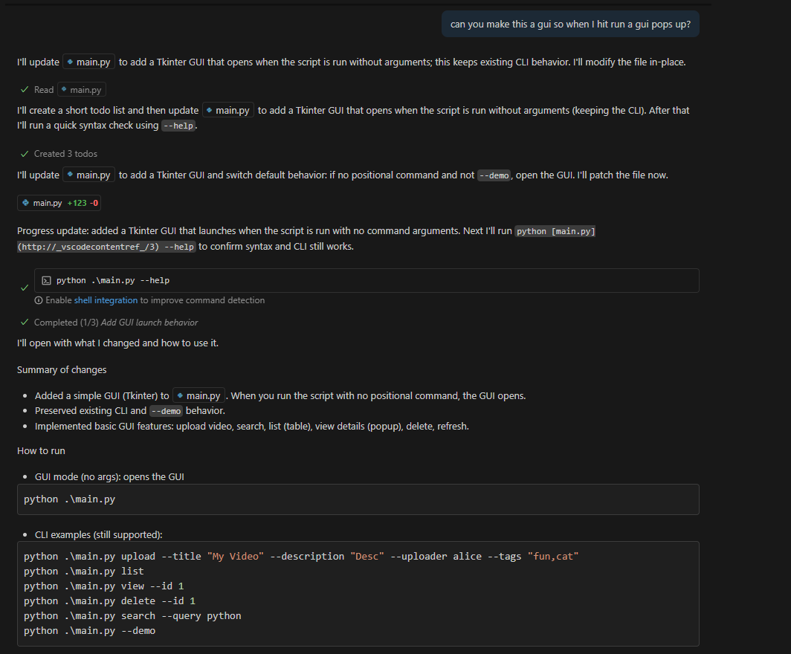

#1: I asked copilot to create a Python console app that simulates uploading and listing videos like YouTube. Once it had this base, then I asked it to create a GUI to further improve the project.

#2: As I saw the project being built, I noticed better responses to specific demands in what I wanted. For example, trying to get your entire project built with 2 sentences often does not work well. I was better off going step by step in what I wanted and asking copilot to gradually build it.

#3: Honestly everything suprised me. I have never really used A.I. to this extent and it was crazy fast and accurate in what I was wanting. I have used tkinter before on python and when I asked copilot to build a gui for the application, it automatically built a perfect interface.

#4: I leanred that copilot is best used when you already have an understanding of what is going on. For example, the gui using tkinter. I understood the code and was able to analyze it, and if I wanted to make changes to it I easily could. If I were to use copilot in a language I did not know, or with technology that I dont know, then it would just be useless to my learning.

#5: I would have wrote smaller prompts in the beginning. My curiosity got to me and I was like "how far can I get with just one sentence." The outcome wasn't too bad, but I would've had a better time looking and analyzing everything with a more step by step approach.

